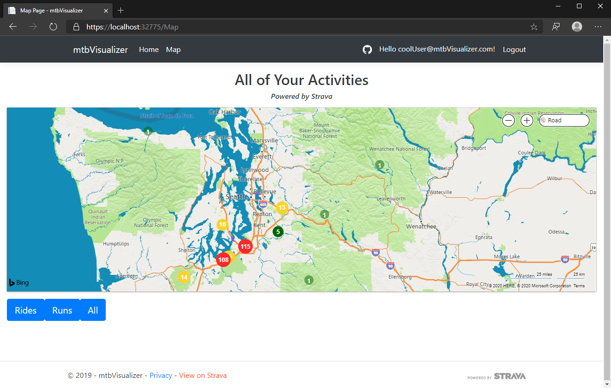
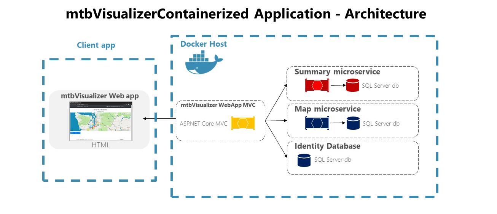

# mtbVisualizerContainerized
## Visualize your Strava data
Restructured version of a previous project, [mtbVisualizer](https://github.com/isaacaflores2/mtbVisualizer), that utilizes a microservice architecture and Docker containers!

## Additional Technologies
The new web application adds the following technologies to be able to request, display, and save your data:
1. Docker 
2. Docker Compse

## Project References
I utilized the following resources as references for the project architecture and utilizing Docker:
1. [eShopOnContainers](https://github.com/dotnet-architecture/eShopOnContainers)
2. [.NET Microservices: Architecture for Containerized .NET Applications](https://docs.microsoft.com/en-us/dotnet/architecture/microservices/)
3. [Quickstart: Compose and ASP.NET Core with SQL Serve](https://docs.docker.com/compose/aspnet-mssql-compose/)

## Application Architecture 
The ASP.NET Core MVC application uses two microservices using Http as the communication protocol to request and display Strava data. Each service has their own Strava client and stores their own data. The MVC application uses a seperate identity database to store user login information. 

